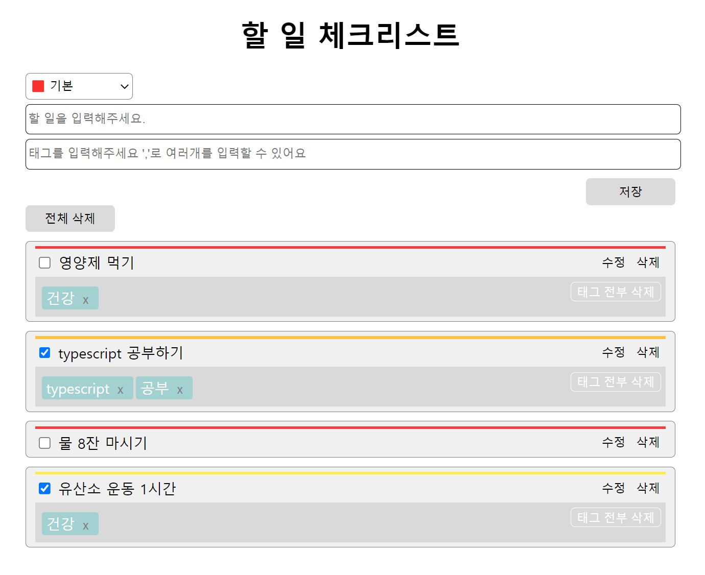

# 할 일 체크리스트 API docs

## 프로젝트 개요

프리온보딩 프론트엔드 챌린지 9월(TypeScript) 참여 과제

작성자 : 이가은

### 할 일 체크리스트 실행 결과



### 할 일 체크리스트 실행방법

```shell
$ npm ci
$ npm run build
```

이후 live-server 를 사용해서 실행

### JSDoc 작성

https://gaeundev.github.io/wanted-pre-onboarding-challenge-fe-2/out/index.html

## Members

### [todoList](global.html#todoList)

## Methods

### [CREATE](global.html#createTodo)

### [READ](global.html#readTodo)

### [READ LIST](global.html#readTodoList)

### [UPDATE](global.html#multiplication)

### [DELETE (할 일)](global.html#updateTodo)

### [DELETE (할 일의 태그)](global.html#deleteTodoTag)

## Type Definitions

### [Todo](global.html#Todo)
